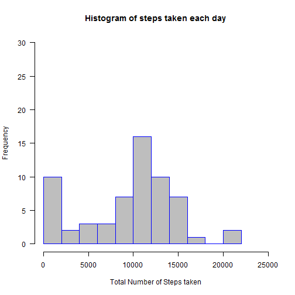
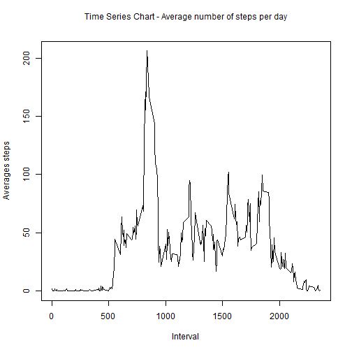
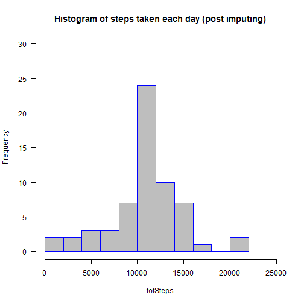
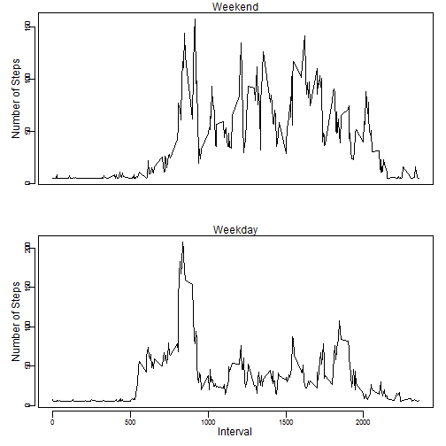

# Reproduceable Research - Course Project-1
============================================
Author: Narayan

Modified date : 12/27/2017

## Hitogram of number of steps taken per day



#### Calculate Mean and Median of the total number of steps taken per day
#### print the values in an HTML table 


```r
library(xtable)

medianWithoutNA <- function(x) {
   median(x[which(!is.na(x) & x > 0)])
}

avgStepsPerDay <- with(MyData, tapply(steps, date, mean, na.rm = T))
medStepsPerDay <- with(MyData, tapply(steps, date, medianWithoutNA))
d1 <- data.frame(date = names(avgStepsPerDay), avgSteps=avgStepsPerDay)
d1$medSteps <- medStepsPerDay
rownames(d1) <- c()
xt <- xtable(d1)
names(xt) <- c('Date', 'Mean of steps Taken per Day','Median of steps Taken per Day')
print(xt, type="html")
```

<!-- html table generated in R 3.4.1 by xtable 1.8-2 package -->
<!-- Thu Dec 28 23:59:47 2017 -->
<table border=1>
<tr> <th>  </th> <th> Date </th> <th> Mean of steps Taken per Day </th> <th> Median of steps Taken per Day </th>  </tr>
  <tr> <td align="right"> 1 </td> <td> 2012-10-01 </td> <td align="right">  </td> <td align="right">  </td> </tr>
  <tr> <td align="right"> 2 </td> <td> 2012-10-02 </td> <td align="right"> 0.44 </td> <td align="right"> 63.00 </td> </tr>
  <tr> <td align="right"> 3 </td> <td> 2012-10-03 </td> <td align="right"> 39.42 </td> <td align="right"> 61.00 </td> </tr>
  <tr> <td align="right"> 4 </td> <td> 2012-10-04 </td> <td align="right"> 42.07 </td> <td align="right"> 56.50 </td> </tr>
  <tr> <td align="right"> 5 </td> <td> 2012-10-05 </td> <td align="right"> 46.16 </td> <td align="right"> 66.00 </td> </tr>
  <tr> <td align="right"> 6 </td> <td> 2012-10-06 </td> <td align="right"> 53.54 </td> <td align="right"> 67.00 </td> </tr>
  <tr> <td align="right"> 7 </td> <td> 2012-10-07 </td> <td align="right"> 38.25 </td> <td align="right"> 52.50 </td> </tr>
  <tr> <td align="right"> 8 </td> <td> 2012-10-08 </td> <td align="right">  </td> <td align="right">  </td> </tr>
  <tr> <td align="right"> 9 </td> <td> 2012-10-09 </td> <td align="right"> 44.48 </td> <td align="right"> 48.00 </td> </tr>
  <tr> <td align="right"> 10 </td> <td> 2012-10-10 </td> <td align="right"> 34.38 </td> <td align="right"> 56.50 </td> </tr>
  <tr> <td align="right"> 11 </td> <td> 2012-10-11 </td> <td align="right"> 35.78 </td> <td align="right"> 35.00 </td> </tr>
  <tr> <td align="right"> 12 </td> <td> 2012-10-12 </td> <td align="right"> 60.35 </td> <td align="right"> 46.00 </td> </tr>
  <tr> <td align="right"> 13 </td> <td> 2012-10-13 </td> <td align="right"> 43.15 </td> <td align="right"> 45.50 </td> </tr>
  <tr> <td align="right"> 14 </td> <td> 2012-10-14 </td> <td align="right"> 52.42 </td> <td align="right"> 60.50 </td> </tr>
  <tr> <td align="right"> 15 </td> <td> 2012-10-15 </td> <td align="right"> 35.20 </td> <td align="right"> 54.00 </td> </tr>
  <tr> <td align="right"> 16 </td> <td> 2012-10-16 </td> <td align="right"> 52.38 </td> <td align="right"> 64.00 </td> </tr>
  <tr> <td align="right"> 17 </td> <td> 2012-10-17 </td> <td align="right"> 46.71 </td> <td align="right"> 61.50 </td> </tr>
  <tr> <td align="right"> 18 </td> <td> 2012-10-18 </td> <td align="right"> 34.92 </td> <td align="right"> 52.50 </td> </tr>
  <tr> <td align="right"> 19 </td> <td> 2012-10-19 </td> <td align="right"> 41.07 </td> <td align="right"> 74.00 </td> </tr>
  <tr> <td align="right"> 20 </td> <td> 2012-10-20 </td> <td align="right"> 36.09 </td> <td align="right"> 49.00 </td> </tr>
  <tr> <td align="right"> 21 </td> <td> 2012-10-21 </td> <td align="right"> 30.63 </td> <td align="right"> 48.00 </td> </tr>
  <tr> <td align="right"> 22 </td> <td> 2012-10-22 </td> <td align="right"> 46.74 </td> <td align="right"> 52.00 </td> </tr>
  <tr> <td align="right"> 23 </td> <td> 2012-10-23 </td> <td align="right"> 30.97 </td> <td align="right"> 56.00 </td> </tr>
  <tr> <td align="right"> 24 </td> <td> 2012-10-24 </td> <td align="right"> 29.01 </td> <td align="right"> 51.50 </td> </tr>
  <tr> <td align="right"> 25 </td> <td> 2012-10-25 </td> <td align="right"> 8.65 </td> <td align="right"> 35.00 </td> </tr>
  <tr> <td align="right"> 26 </td> <td> 2012-10-26 </td> <td align="right"> 23.53 </td> <td align="right"> 36.50 </td> </tr>
  <tr> <td align="right"> 27 </td> <td> 2012-10-27 </td> <td align="right"> 35.14 </td> <td align="right"> 72.00 </td> </tr>
  <tr> <td align="right"> 28 </td> <td> 2012-10-28 </td> <td align="right"> 39.78 </td> <td align="right"> 61.00 </td> </tr>
  <tr> <td align="right"> 29 </td> <td> 2012-10-29 </td> <td align="right"> 17.42 </td> <td align="right"> 54.50 </td> </tr>
  <tr> <td align="right"> 30 </td> <td> 2012-10-30 </td> <td align="right"> 34.09 </td> <td align="right"> 40.00 </td> </tr>
  <tr> <td align="right"> 31 </td> <td> 2012-10-31 </td> <td align="right"> 53.52 </td> <td align="right"> 83.50 </td> </tr>
  <tr> <td align="right"> 32 </td> <td> 2012-11-01 </td> <td align="right">  </td> <td align="right">  </td> </tr>
  <tr> <td align="right"> 33 </td> <td> 2012-11-02 </td> <td align="right"> 36.81 </td> <td align="right"> 55.50 </td> </tr>
  <tr> <td align="right"> 34 </td> <td> 2012-11-03 </td> <td align="right"> 36.70 </td> <td align="right"> 59.00 </td> </tr>
  <tr> <td align="right"> 35 </td> <td> 2012-11-04 </td> <td align="right">  </td> <td align="right">  </td> </tr>
  <tr> <td align="right"> 36 </td> <td> 2012-11-05 </td> <td align="right"> 36.25 </td> <td align="right"> 66.00 </td> </tr>
  <tr> <td align="right"> 37 </td> <td> 2012-11-06 </td> <td align="right"> 28.94 </td> <td align="right"> 52.00 </td> </tr>
  <tr> <td align="right"> 38 </td> <td> 2012-11-07 </td> <td align="right"> 44.73 </td> <td align="right"> 58.00 </td> </tr>
  <tr> <td align="right"> 39 </td> <td> 2012-11-08 </td> <td align="right"> 11.18 </td> <td align="right"> 42.50 </td> </tr>
  <tr> <td align="right"> 40 </td> <td> 2012-11-09 </td> <td align="right">  </td> <td align="right">  </td> </tr>
  <tr> <td align="right"> 41 </td> <td> 2012-11-10 </td> <td align="right">  </td> <td align="right">  </td> </tr>
  <tr> <td align="right"> 42 </td> <td> 2012-11-11 </td> <td align="right"> 43.78 </td> <td align="right"> 55.00 </td> </tr>
  <tr> <td align="right"> 43 </td> <td> 2012-11-12 </td> <td align="right"> 37.38 </td> <td align="right"> 42.00 </td> </tr>
  <tr> <td align="right"> 44 </td> <td> 2012-11-13 </td> <td align="right"> 25.47 </td> <td align="right"> 57.00 </td> </tr>
  <tr> <td align="right"> 45 </td> <td> 2012-11-14 </td> <td align="right">  </td> <td align="right">  </td> </tr>
  <tr> <td align="right"> 46 </td> <td> 2012-11-15 </td> <td align="right"> 0.14 </td> <td align="right"> 20.50 </td> </tr>
  <tr> <td align="right"> 47 </td> <td> 2012-11-16 </td> <td align="right"> 18.89 </td> <td align="right"> 43.00 </td> </tr>
  <tr> <td align="right"> 48 </td> <td> 2012-11-17 </td> <td align="right"> 49.79 </td> <td align="right"> 65.50 </td> </tr>
  <tr> <td align="right"> 49 </td> <td> 2012-11-18 </td> <td align="right"> 52.47 </td> <td align="right"> 80.00 </td> </tr>
  <tr> <td align="right"> 50 </td> <td> 2012-11-19 </td> <td align="right"> 30.70 </td> <td align="right"> 34.00 </td> </tr>
  <tr> <td align="right"> 51 </td> <td> 2012-11-20 </td> <td align="right"> 15.53 </td> <td align="right"> 58.00 </td> </tr>
  <tr> <td align="right"> 52 </td> <td> 2012-11-21 </td> <td align="right"> 44.40 </td> <td align="right"> 55.00 </td> </tr>
  <tr> <td align="right"> 53 </td> <td> 2012-11-22 </td> <td align="right"> 70.93 </td> <td align="right"> 65.00 </td> </tr>
  <tr> <td align="right"> 54 </td> <td> 2012-11-23 </td> <td align="right"> 73.59 </td> <td align="right"> 113.00 </td> </tr>
  <tr> <td align="right"> 55 </td> <td> 2012-11-24 </td> <td align="right"> 50.27 </td> <td align="right"> 65.50 </td> </tr>
  <tr> <td align="right"> 56 </td> <td> 2012-11-25 </td> <td align="right"> 41.09 </td> <td align="right"> 84.00 </td> </tr>
  <tr> <td align="right"> 57 </td> <td> 2012-11-26 </td> <td align="right"> 38.76 </td> <td align="right"> 53.00 </td> </tr>
  <tr> <td align="right"> 58 </td> <td> 2012-11-27 </td> <td align="right"> 47.38 </td> <td align="right"> 57.00 </td> </tr>
  <tr> <td align="right"> 59 </td> <td> 2012-11-28 </td> <td align="right"> 35.36 </td> <td align="right"> 70.00 </td> </tr>
  <tr> <td align="right"> 60 </td> <td> 2012-11-29 </td> <td align="right"> 24.47 </td> <td align="right"> 44.50 </td> </tr>
  <tr> <td align="right"> 61 </td> <td> 2012-11-30 </td> <td align="right">  </td> <td align="right">  </td> </tr>
   </table>

#### Calculate average number of steps taken in each 5 minute interval across all days 
#### store values in a data frame
#### plot the time series chart
#### Calculate mean value per each 5 minute interval
#### Find the max value of the mean values and the corresponding interval value
#### Print both values


```r
avgStepsPerInterval <- with(MyData, tapply(steps, interval, mean, na.rm = T))
d2 <- data.frame(interval = names(avgStepsPerInterval), avgSteps=avgStepsPerInterval)
plot(as.integer(as.character(d2$interval)), d2$avgSteps,type="l", xlab="Interval", ylab="Averages steps") ## Time series plot. Covert interval from factor to Int.
mtext("Time Series Chart - Average number of steps per day",side=3, line=2)
```



```r
maxMeanVal <- max(d2$avgSteps)
intrname <- as.character(d2[d2$avgSteps==maxMeanVal,1]) ## Convert factor to charater before printing
sprintf("5 minute interval that contains maximum number of steps (%f)on average is : %s", maxMeanVal,intrname )
```

```
## [1] "5 minute interval that contains maximum number of steps (206.169811)on average is : 835"
```


#### Impute values for missing values by filling in monthly mean values. you can go to day or interval level as well if you want to.
#### Calculate the total number of steps taken again and create a histogram again
#### Process data by intervals and divide data into weekend and weekdays data sets. Plot time series charts


```r
library(chron)

p1 <- MyData[!is.na(MyData$steps) & as.character(MyData$date,"%m") == "10",]
OctMean <- mean(p1$steps, na.rm=TRUE) ## Calculate Oct mean
MyData[is.na(MyData$steps) & as.character(MyData$date,"%m") == "10",]$steps = OctMean ## fill all NA values with Oct mean

p2 <- MyData[!is.na(MyData$steps) & as.character(MyData$date,"%m") == "11",]
NovMean <- mean(p2$steps, na.rm=TRUE) ## Calculate Nov mean
MyData[is.na(MyData$steps) & as.character(MyData$date,"%m") == "11",]$steps = NovMean ## fill all NA values with Nov mean

totSteps <- with(MyData, tapply(steps, date, sum, na.rm = T)) 
hist(totSteps, xlim = c(0,25000), ylim=c(0,30), main="Histogram of steps taken each day (post imputing)", breaks=10, las=1, border="blue", col="gray")
```



```r
WEMyData <- (MyData[is.weekend(MyData$date),])
WDMyData <- (MyData[!is.weekend(MyData$date),])
WEGraph <- tapply(WEMyData$steps,WEMyData$interval,mean)
WDGraph <- tapply(WDMyData$steps,WDMyData$interval,mean)
d2 <- data.frame(interval=names(WEGraph), avgSteps=WEGraph)

par(mfrow=c(2,1), mgp=c(.25,.25,.25), mar=c(3, 3, 1, 1))
plot(names(WEGraph), WEGraph, type="l", axes=FALSE, ann= FALSE, main="par(mar=c(1, 2, 2, 1))")
axis(2, cex.axis=.7)
box()
mtext("Number of Steps", side=2, line=1.3)
mtext("Weekend", side=3, line=0)

plot(names(WDGraph), WDGraph, type = "l", axes=FALSE, ann= FALSE, main="par(mar=c(3, 2, 1, 1))")
axis(1, cex.axis=.7)
axis(2, cex.axis=.7)
box()
mtext("Interval", side=1, line=1.3)
mtext("Number of Steps", side=2, line=1.3)
mtext("Weekday", side=3, line=0)
```


